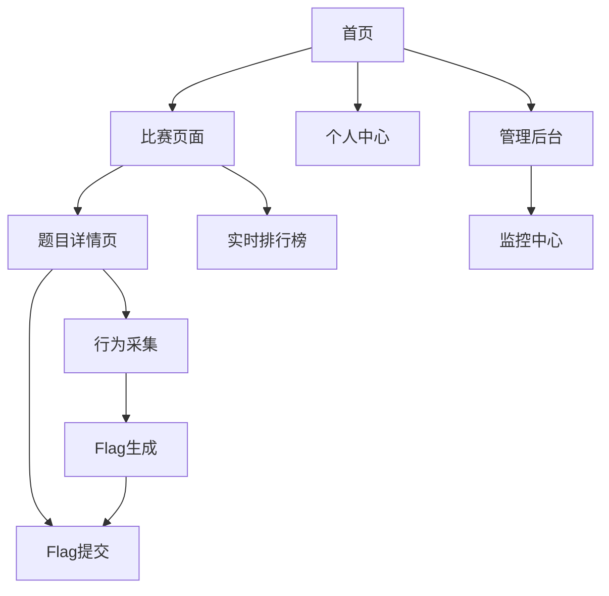

## 1. Product Overview
基于多模态行为特征的CTF动态Flag防作弊系统是一个创新的网络安全竞赛平台，通过采集参赛者的多模态生物特征（如键击动态、鼠标轨迹等）作为flag生成的熵源，结合区块链技术实现不可篡改的唯一flag生成与验证系统。
- 解决传统CTF平台存在的竞赛结果难以溯源、提交内容可能被篡改、抄袭等问题，保证竞赛的公开、公平、公正化。
- 该平台面向网络安全教育机构、竞赛组织者和参赛学生，通过技术创新提升CTF竞赛的安全性与公平性。

## 2. Core Features

### 2.1 User Roles
| Role | Registration Method | Core Permissions |
|------|---------------------|------------------|
| 管理员 | 系统预设账号 | 平台管理、比赛创建、用户管理、数据监控 |
| 比赛组织者 | 邮箱注册+管理员审核 | 创建比赛、题目管理、成绩查看、作弊监控 |
| 参赛选手 | 邮箱注册+行为特征采集 | 参加比赛、提交flag、查看排名、个人数据 |

### 2.2 Feature Module
我们的CTF防作弊平台包含以下核心页面：
1. **首页**：平台介绍、比赛列表、公告通知、用户导航
2. **比赛页面**：题目列表、实时排行榜、比赛信息、提交记录
3. **题目详情页**：题目描述、附件下载、flag提交、行为采集
4. **管理后台**：用户管理、比赛管理、题目管理、监控面板
5. **个人中心**：个人信息、参赛记录、行为模板、成绩统计
6. **监控中心**：实时监控、异常预警、数据分析、审计日志

### 2.3 Page Details
| Page Name | Module Name | Feature description |
|-----------|-------------|---------------------|
| 首页 | 导航栏 | 显示平台logo、主要功能入口、用户登录状态 |
| 首页 | 比赛列表 | 展示进行中和即将开始的比赛，支持筛选和搜索 |
| 首页 | 公告区域 | 显示重要通知、平台更新、比赛公告 |
| 比赛页面 | 题目列表 | 按分类显示题目，包含难度、分值、解题人数 |
| 比赛页面 | 实时排行榜 | 显示参赛队伍排名、得分、解题进度 |
| 比赛页面 | 比赛信息 | 比赛规则、时间安排、奖项设置 |
| 题目详情页 | 题目内容 | 题目描述、提示信息、附件下载链接 |
| 题目详情页 | 行为采集模块 | 实时采集键击节奏、鼠标轨迹等行为数据 |
| 题目详情页 | Flag提交 | 提交答案、验证行为特征、记录提交历史 |
| 管理后台 | 用户管理 | 用户列表、权限设置、行为模板查看 |
| 管理后台 | 比赛管理 | 创建比赛、设置规则、发布题目 |
| 管理后台 | 监控面板 | 实时监控比赛状态、异常检测、数据统计 |
| 个人中心 | 个人信息 | 基本信息编辑、密码修改、行为特征状态 |
| 个人中心 | 参赛记录 | 历史比赛记录、成绩统计、解题情况 |
| 监控中心 | 实时监控 | 监控用户行为、flag提交、异常操作 |
| 监控中心 | 数据分析 | 行为特征分析、作弊检测结果、统计报表 |

## 3. Core Process
**管理员流程：**
管理员登录后台 → 创建比赛 → 添加题目 → 设置比赛规则 → 开启比赛 → 监控比赛过程 → 处理异常情况 → 比赛结束后导出结果

**参赛选手流程：**
用户注册 → 行为特征初始化采集 → 浏览比赛列表 → 进入比赛 → 选择题目 → 行为特征实时采集 → 生成个性化flag → 解题并提交flag → 行为验证 → 获得分数 → 查看排名

**作弊检测流程：**
用户操作 → 行为特征采集 → 与历史模板比对 → 异常检测 → 触发预警 → 管理员处理 → 记录审计日志

## 4. User Interface Design
### 4.1 Design Style
- **主色调：** 深蓝色(#1a365d)和橙色(#ed8936)，体现网络安全的专业性和竞赛的活力
- **辅助色：** 灰色(#718096)用于文本，绿色(#38a169)用于成功状态，红色(#e53e3e)用于警告
- **按钮样式：** 圆角矩形按钮，支持悬停效果和点击反馈
- **字体：** 中文使用思源黑体，英文使用Roboto，代码使用Fira Code，主要字号14px-18px
- **布局风格：** 卡片式布局，顶部导航栏，响应式设计
- **图标风格：** 使用线性图标，支持暗色主题切换

### 4.2 Page Design Overview
| Page Name | Module Name | UI Elements |
|-----------|-------------|-------------|
| 首页 | 导航栏 | 深蓝色背景，白色文字，logo居左，用户信息居右 |
| 首页 | 比赛列表 | 卡片式布局，每个比赛一张卡片，包含状态标签和进度条 |
| 比赛页面 | 题目列表 | 表格形式，支持分类筛选，难度用颜色标识 |
| 比赛页面 | 排行榜 | 实时更新的表格，前三名高亮显示 |
| 题目详情页 | 行为采集区域 | 半透明遮罩，显示采集进度和状态提示 |
| 管理后台 | 侧边栏 | 深色侧边栏，图标+文字导航，支持折叠 |
| 监控中心 | 数据面板 | 仪表盘式布局，图表和数据卡片组合 |

### 4.3 Responsiveness
平台采用桌面优先的响应式设计，支持移动端适配。在移动设备上优化触摸交互，确保行为特征采集的准确性。支持暗色主题切换以适应不同使用环境。